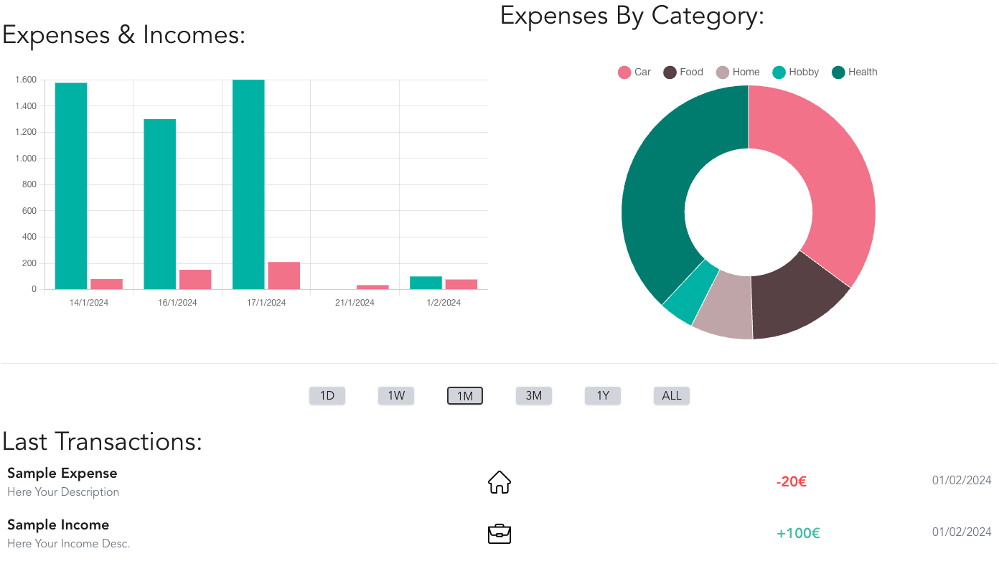

[![LinkedIn][linkedin-shield]][linkedin-url] 
[![Start2Impact University][Start2Impact-shield]][Start2Impact-url]
[![MIT License][license-shield]][license-url]
[![Portfolio][Portfolio-shield]][Portfolio-url]
[![Instagram][instragram-shield]][instragram-url]


<!-- PROJECT LOGO -->
<br />
<div align="center">
  <a href="https://github.com/sorbrex/MoneyKeeper.git">
    
  </a>

<h3 align="center">Money Keeper</h3>

  <p align="center">
    Always track your Expenses with Awesome Information and Graphs !
    <br />
    <br />
    <a href="https://fire-money-keeper.web.app/">Open Page</a>
    ·
    <a href="https://github.com/sorbrex/MoneyKeeper.git/issues">Report Bug</a>
    ·
    <a href="https://github.com/sorbrex/MoneyKeeper.git/issues">Request Feature</a>
  </p>
</div>


<!-- TABLE OF CONTENTS -->
<details>
  <summary>Table of Contents</summary>
  <ol>
    <li>
      <a href="#about-the-project">About The Project</a>
      <ul>
        <li><a href="#built-with">Built With</a></li>
      </ul>
    </li>
    <li>
      <a href="#getting-started">Getting Started</a>
      <ul>
        <li><a href="#prerequisites">Prerequisites</a></li>
        <li><a href="#installation">Installation</a></li>
      </ul>
    </li>
    <li><a href="#roadmap">Roadmap</a></li>
    <li><a href="#license">License</a></li>
    <li><a href="#contact">Contact</a></li>
    <li><a href="#acknowledgments">Acknowledgments</a></li>
  </ol>
</details>


<!-- ABOUT THE PROJECT -->
## About The Project
<div align="center">
  
</div>

This Web Application was born as the final project of the Full Stack Developer course followed at Start2Impact University.
It aims to give a clear view of our financial movements. It provides accurate data through filters and groupings that allow us to better understand the trend of our spending habits.

### Built With

* [](https://vitejs.dev/)
* [](https://www.typescriptlang.org/)
* [](https://reactjs.org/)
* [](https://tanstack.com/)
* [](https://tailwindcss.com/)
* [](https://redux-toolkit.js.org/rtk-query/overview)
* [](https://reactrouter.com/en/main)
* [](https://firebase.google.com/)

<!-- GETTING STARTED -->
## Getting Started

To get a local copy up and running follow these steps.

### Prerequisites

* Git
    - [Install GIT](https://git-scm.com/downloads)


* Node 18.0.0
  - [Use NVM](https://github.com/nvm-sh/nvm)


* Npm
  ```sh
  npm install npm@latest -g
  ```
  
### Installation

1. Clone the repo
   ```sh
   git clone https://github.com/sorbrex/MoneyKeeper
   ```
3. Install Dependencies
   ```sh
   npm install --save-dev
   ```
4. Run the project
   ```sh
    npm run dev
    ```
   

<!-- ROADMAP -->
## Roadmap

- [ ] Add Auto Switch UI Labels and Data Representation For Long Range of Dates
- [ ] Add Multi Currency Support
- [ ] Add Better Categories Management
    - [ ] Family Categories
    - [ ] Personal Categories
    - [ ] Custom Categories

See the [open issues](https://github.com/sorbrex/MoneyKeeper.git/issues) for a full list of proposed features (and known issues).


<!-- LICENSE -->
## License

Distributed under the MIT License. See `LICENSE` for more information.


<!-- CONTACT -->
## Contact

Nando Sorbello - [@instagram](https://www.instagram.com/sorbrex.ns/) - nandosorbello.dev@gmail.com

Project Link: [https://github.com/sorbrex/MoneyKeeper.git](https://github.com/sorbrex/MoneyKeeper.git)


<!-- ACKNOWLEDGMENTS -->
## Acknowledgments

[](https://eslint.org/)
[](https://github.com/brix/crypto-js)
[](https://github.com/axios/axios)
[](https://github.com/jquense/yup)


<!-- MARKDOWN LINKS & IMAGES -->
[license-shield]: https://img.shields.io/github/license/othneildrew/Best-README-Template.svg?style=for-the-badge
[license-url]: https://github.com/sorbrex/MoneyKeeper/blob/main/LICENSE
[linkedin-shield]: https://img.shields.io/badge/-LinkedIn-black.svg?style=for-the-badge&logo=linkedin&colorB=555
[linkedin-url]: https://www.linkedin.com/in/sorbellonando/
[instragram-shield]: https://img.shields.io/badge/-Instagram-black.svg?style=for-the-badge&logo=instagram&colorB=555
[instragram-url]: https://www.instagram.com/sorbrex.ns/
[Start2Impact-shield]: https://img.shields.io/badge/start2impact-university-green?style=for-the-badge
[Start2Impact-url]: https://talent.start2impact.it/profile/nando-sorbello
[Portfolio-shield]: https://img.shields.io/badge/Personal-Website-orange.svg?style=for-the-badge
[Portfolio-url]: https://nandosorbello.altervista.org/